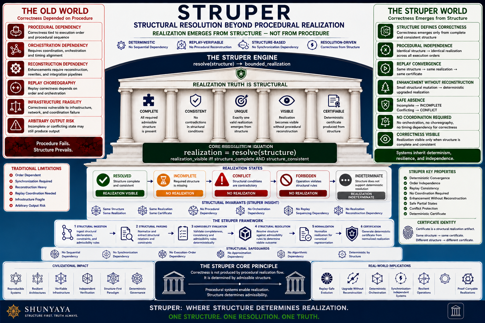

# ⭐ **STRUPER**

## **Structural Resolution Beyond Procedural Realization**


[](https://github.com/OMPSHUNYAYA/STRUPER/actions/workflows/struper-verify.yml)

---

**Where mature structure resolves and realization becomes visible — deterministically, reproducibly, and beyond procedural realization dependence.**

STRUPER is the structural realization layer of the Shunyaya ecosystem.

It explores a strict structural direction:

> **Correctness and bounded realization may not fundamentally require procedural realization flow as the source of correctness.**

Procedural systems may still exist.

But once structure becomes complete and consistent, procedure becomes:

- a realization capability
- a realization pathway
- a realization substrate

—not the origin of admissibility itself.

STRUPER formalizes this structural direction through a simple invariant:

`realization = resolve(structure)`

`realization_visible iff structure_complete AND structure_consistent`

---

## ⚡ **90-Second Structural Proof**

Run:

```
python demo/struper_demo_v1_0.py
```

Expected observable behavior:

- same structure -> same realization
- same structure -> same output certificate
- replay -> deterministic realization continuity
- procedural variation -> invariant correctness
- incomplete structure -> `INCOMPLETE`
- conflicting structure -> `CONFLICT`

---

## 🧩 **Structural Vocabulary (Quick Reference)**

| Symbol | Meaning |
|---|---|
| `structure_complete` | All required structural declarations are present |
| `structure_consistent` | No contradictions exist in structural relationships |
| `resolve(structure)` | Deterministic structural resolution function |
| `realization_visible` | True only when structure is complete AND consistent |
| `output_certificate (σ)` | Deterministic realization fingerprint |
| `RESOLVED` | Realization admitted |
| `INCOMPLETE` | Structural absence |
| `CONFLICT` | Structural contradiction |
| `capsule` | Bounded structural realization space |
| `carry_forward` | Reuse of mature realization structure |

---

## 🚀 **The Core Insight**

Traditional systems usually assume:

`procedure -> realization -> correctness`

STRUPER demonstrates:

`structure -> resolution -> realization`

This changes the evolution model itself.

Traditional enhancement often requires:

- rebuilding procedural realization flow  
- modifying execution paths  
- reconstructing orchestration logic  
- reworking realization dependencies  
- maintaining procedural branching  

STRUPER demonstrates:

`small structural extension -> deterministic upgraded realization`

without reconstructing the mature realization structure.

---

## 🌀 **Connection to Shunyaya — Zero as Dynamic Structural Baseline**

STRUPER extends a foundational direction from the Shunyaya framework:

> **Zero is not treated as absence.  
> Zero is treated as a dynamic structural baseline from which admissibility, posture, and realization become visible.**

From this baseline, structure may:

- emerge
- stabilize
- accumulate constraints
- preserve continuity
- govern admissibility
- evolve across realization layers

STRUPER applies this direction specifically to the realization layer.

Traditional realization systems often assume:

`procedure -> realization -> correctness`

STRUPER instead evaluates whether:

`realization = resolve(structure)`

where realization visibility depends on structural maturity rather than procedural realization choreography.

This produces the structural direction:

- structural posture -> admissibility
- admissibility -> deterministic realization
- deterministic realization -> replay-safe continuity

Classical outputs remain unchanged:

`phi((m, a, s)) = m`

STRUPER does not replace classical correctness.

It adds:

- structural admissibility
- realization visibility
- replay determinism
- structural carry-forward
- continuity-aware realization governance

across bounded realization spaces.

The broader Shunyaya framework expands these ideas across multiple structural layers:

- `SSOM` -> structural origin admissibility
- `SSM` -> structural posture visibility
- `SSUM` -> structural evolution and accumulation
- `SSD` -> structural diagnosis
- `SSE` -> structural trust and governance

See the [Shunyaya Symbolic Mathematics Master Docs](https://github.com/OMPSHUNYAYA/Shunyaya-Symbolic-Mathematics-Master-Docs)

for the complete structural framework.

---

## 🧱 **The Unifying Principle**

`realization = resolve(structure)`

If bounded realization remains after removing procedural realization dependence for correctness, then procedural realization was not the fundamental source of correctness.

In that realization space, structure preserved admissibility independently of procedural realization flow.

---

## ⚙️ **Minimal Operational Semantics (Phase I)**

STRUPER models bounded realization through deterministic structural admissibility.

Given:

`S = structural state`

Resolution semantics:

`resolve(S) -> RESOLVED`
iff
`complete(S) AND consistent(S)`

`resolve(S) -> INCOMPLETE`
iff
`NOT complete(S)`

`resolve(S) -> CONFLICT`
iff
`contradiction(S)`

Visibility semantics:

`realization_visible iff resolve(S) = RESOLVED`

Replay semantics:

`S1 = S2 -> Output1 = Output2 -> Certificate1 = Certificate2`

Procedural realization variation does not affect admissibility:

`resolve(S, P1) = resolve(S, P2)`

for all admissible procedural realization paths `P1`, `P2`.

Thus:

`procedural_variation != correctness_variation`

Correctness remains a property of structure.

Not fundamentally of procedural realization flow.

---

## 🧩 **Structural Evolution Demonstration**

The STRUPER demonstrations explore a critical structural property:

Only bounded structural capsules changed.

The mature realization structure remained intact.  
The realization layer remained intact.  
The reusable structural continuity remained intact.

Yet:

a new deterministic realization emerged.

This demonstrates:

`enhancement != procedural reconstruction`

---

## 🔁 **Determinism & Reproducibility**

STRUPER treats realization correctness as a reproducible structural artifact.

`same structure -> same realization -> same output certificate`

`same mature structure -> same bounded realization`

`same structural carry-forward -> deterministic realization continuity`

This enables:

- deterministic regeneration  
- replay verification  
- reusable realization capsules  
- deterministic structural evolution  
- structural continuity  
- replay-safe enhancement  
- reduced procedural burden  
- similar-system carry-forward  

---

## 🧠 **Why Determinism Matters**

Deterministic realization continuity enables:

- replay-safe upgrades  
- structural carry-forward  
- reusable realization templates  
- deterministic system evolution  
- continuity-preserving enhancement  
- realization diffability  
- audit-safe structural replay  

This moves realization systems closer to deterministic structural continuity rather than procedural reconstruction.

---

## 📊 **Comparison**

| Model | Procedural Reconstruction Required | Structure-Based | Deterministic |
|---|---|---|---|
| Traditional Procedural Systems | Yes | Partial | Conditional |
| Template / Workflow Systems | Partial | Partial | Conditional |
| STRUPER | Procedural Reconstruction Not Fundamental After Structural Maturity | Yes | Yes |

---

> **Performance note (observable byproduct — not the primary claim):**  
> On the reference workload (`500,000` orders), the structural realization path will often appear significantly faster than the equivalent procedural realization loop because no per-order orchestration or reconstruction flow is required.  
>
> The visible speed improvement is a byproduct of reduced procedural realization dependence.  
>
> The primary invariant remains:
>
> `same structure -> same realization -> same output certificate`

---

## 🌍 **Civilizational Direction**

Traditional realization systems usually scale through:

- larger procedural realization flows  
- increasing orchestration complexity  
- procedural reconstruction  
- repeated realization redesign  
- expanding dependency chains  

STRUPER explores a different structural direction:

- reusable realization structure  
- deterministic structural evolution  
- structure-first realization  
- replay-safe enhancement  
- structural continuity across systems  
- reduced procedural reconstruction burden after structure matures  
- similar-system carry-forward  

---

## ⚠️ **Clarification — Structural Resolution**

STRUPER does not claim:

- elimination of procedural systems  
- elimination of realization environments  
- replacement of all programming systems  
- guaranteed runtime superiority  
- universal structural compressibility  

What STRUPER demonstrates:

Correctness and bounded realization may not fundamentally require procedural realization flow as the source of correctness.

Procedural realization may reveal what structure already admits.

Structure determines admissibility.

---

### Important Boundary

STRUPER does not claim that all realization spaces are structurally compressible.

Some systems fundamentally depend on:

- runtime interaction  
- irreversible state mutation  
- environment-dependent transitions  
- non-replayable external inputs  
- dynamically emergent procedural behavior  

STRUPER applies specifically to bounded realization spaces that remain structurally resolvable after structural maturity.

---

## ❓ **How STRUPER Differs from Declarative Systems, Workflow Engines, or Constraint Solvers**

While there are partial conceptual overlaps, STRUPER is distinct in focus, structural direction, and realization behavior.

### Primary Focus

STRUPER focuses on:

- deterministic structural realization  
- structural carry-forward  
- reduced procedural burden after structural maturity  
- reusable realization continuity  
- deterministic structural evolution  
- replay-safe realization continuity  
- similar-system structural reuse  

rather than:

- query answering  
- execution orchestration  
- workflow automation  
- rule derivation  
- runtime planning  
- procedural optimization  

---

## ⚠️ **Known Limitations (Phase I)**

Phase I is intentionally minimal and focuses on isolating the structural invariant as clearly as possible.

Current limitations include:

- reference demonstrations are intentionally minimal (`pure Python + standard library only`)
- no distributed structural realization layer yet
- no persistence, orchestration, or large-scale realization infrastructure yet
- performance characteristics and scalability behavior are not yet formally benchmarked
- focus remains deterministic realization continuity and reduced procedural burden — not runtime optimization
- formal machine-checkable verification systems are planned for future phases
- production deployment requires independent validation and domain-specific testing

These limitations are deliberate.

Minimal systems isolate structural invariants more clearly.

Phase I focuses specifically on demonstrating:

`same structure -> same realization -> same output certificate`

and:

`small structural extension -> deterministic upgraded realization`

without requiring procedural realization flow as the source of correctness.

---

### Core Safety Guarantee

STRUPER treats safe absence as a first-class structural property.

If structure does not resolve:

- `INCOMPLETE`
- `CONFLICT`

then:

`realization is not visible`

No forced admissibility occurs.

No arbitrary realization is produced.

Absence is treated as structural truth — not as a system failure.

> **Structural absence is treated as truth.**
>
> `INCOMPLETE` and `CONFLICT` are not operational failures.
>
> They are admissibility-preserving structural outcomes.

---

### Structural Evolution Model

STRUPER structural evolution preserves:

- mature realization continuity
- replay determinism
- admissibility continuity
- deterministic output certificates
- reusable realization structure

Small admissible structural extension may produce:

`deterministic upgraded realization`

without reconstructing the mature realization structure itself.

This enables:

- structural inheritance across realization versions
- replay-safe structural evolution
- reusable realization continuity
- similar-system carry-forward
- reduced procedural burden after structure matures

---

### Procedural Realization Independence

STRUPER correctness remains invariant across:

- procedural realization paths
- orchestration flows
- realization ordering
- bounded realization methods
- admissible procedural variation

Invariant:

`same structure -> same realization -> same output certificate`

across all admissible procedural realization paths.

---

### Relationship to Declarative and Workflow Systems

STRUPER may coexist with declarative systems, workflow systems, orchestration layers, and procedural realization environments.

STRUPER can function conceptually as a:

`structural realization and admissibility layer`

beneath procedural realization systems.

However, STRUPER introduces stricter structural guarantees centered around:

- deterministic structural replay  
- reduced procedural burden after structural maturity  
- reusable realization continuity  
- structural carry-forward  
- procedural realization independence of correctness  
- deterministic output certificates  
- bounded realization visibility  

---

## ⚡ **What STRUPER Demonstrates Clearly**

Phase I demonstrates:

- deterministic structural realization  
- replay-safe realization continuity  
- reusable structural evolution  
- reduced procedural reconstruction burden  
- structural carry-forward across similar systems  
- deterministic realization regeneration  
- conflict-safe admissibility  
- structure-defined realization visibility  
- bounded realization beyond procedural realization dependence  

The current scope focuses on minimal structural proof demonstrations.

Future systems may extend these principles into large-scale structural realization environments and reusable realization ecosystems.

---

## 🧠 **Practical Interpretation**

Use procedural realization systems for capability.

Use STRUPER to define realization correctness structurally.

---

## 🧱 **Layer Separation (Critical)**

**Structure Layer:**  
Defines realization capsules, admissibility relationships, and structural continuity

**Capability Layer:**  
Procedural realization environments, orchestration systems, execution substrates

**Interface Layer:**  
Applications, APIs, workflows, user systems

**STRUPER operates primarily at the Structure Layer.**

---

## 🧭 **Visual Overview**



Future versions may include:

- reusable realization capsule graphs  
- multi-module structural continuity  
- structural evolution overlays  
- reusable realization templates  
- replay-safe realization evolution systems  
- structural carry-forward ecosystems  

Invariant remains:

`realization = resolve(structure)`

---

## 🔥 **Break STRUPER**

If procedural realization is fundamentally required for correctness, this invariant must fail:

`same structure -> same realization -> same output certificate`

Or demonstrate:

- incomplete structure -> forced realization  
- conflicting structure -> arbitrary realization  
- structural replay -> divergent realization  
- same mature structure -> inconsistent realization continuity  

If none occur, procedural realization dependence is not fundamental in that realization space.

---

## ⚡ **The Critical Structural Direction**

Across structural systems:

`remove dependency for correctness -> preserve structure -> correctness remains`

---

## ⚡ **Structural Absence Principle**

If structure is incomplete or inconsistent:

realization is not visible

`incomplete -> INCOMPLETE`

`conflict -> CONFLICT`

Absence is treated as structural truth.

---

## 🧪 **Reference Demonstrations**

### **Scenario 1 — Base Structural Realization**
→ deterministic realization visible

### **Scenario 2 — Replay Validation**
→ same structure -> same realization -> same output certificate

### **Scenario 3 — Structural Carry-Forward**
→ mature realization structure reused across a similar system

### **Scenario 4 — Structural Evolution**
→ deterministic upgraded realization through bounded structural extension

### **Scenario 5 — Reduced Procedural Burden**
→ mature structure reused without reconstructing procedural realization flow

### **Scenario 6 — Incomplete Structure**
→ INCOMPLETE

### **Scenario 7 — Conflicting Structure**
→ CONFLICT

---

## 🧩 **From Minimal Proof to Structural Realization Evolution**

These reference demonstrations isolate the structural invariant.

They are intentionally minimal.

Minimal systems isolate the structural truth.  
Larger systems demonstrate structural evolution at scale.

STRUPER explores how realization spaces may evolve through:

- reusable realization structure  
- structural continuity  
- deterministic replay  
- replay-safe structural evolution  
- modular realization inheritance  
- structural carry-forward  
- reusable realization capsules  
- bounded structural extension  

The invariant remains identical:

`same structure -> same realization -> same output certificate`

Scale changes realization visibility.  
It does not change the structural principle.

---

## 🧭 **Framework & References**

### **Docs**

- [Quickstart](docs/Quickstart.md)
- [FAQ](docs/FAQ.md)
- [Proof Sketch](docs/Proof-Sketch.md)  
- [STRUPER Architecture Notes](docs/STRUPER-Architecture-Notes.md)
- [STRUPER Concept Diagram](docs/STRUPER-Diagram.png)  
- [STRUPER Framework Document](docs/STRUPER_v1.1.pdf)  
- [Dependency Elimination Framework](docs/Dependency-Elimination-Framework.png)
- [Shunyaya Structural Stack](docs/Shunyaya-Structural-Stack.png)  

---

## 🧪 **Demonstrations**

### **Reference Demonstration**

- [struper_demo_v1_0.py](demo/struper_demo_v1_0.py)

---

## ⚡ **60-Second Live Verification**

Run:

```
python demo/struper_demo_v1_0.py
```

---

## 🧩 **Expected Structural States**

| Structure State | Resolution State | Realization Visibility |
|---|---|---|
| complete structure | `RESOLVED` | visible |
| incomplete structure | `INCOMPLETE` | absent |
| conflicting structure | `CONFLICT` | absent |

---

## 🔐 **File Integrity Check**

### Linux / macOS

`sha256sum demo/struper_demo_v1_0.py`

### Windows

`certutil -hashfile demo\struper_demo_v1_0.py SHA256`

The hash must exactly match the value recorded in:

- `VERIFY/FREEZE_DEMO_SHA256.txt`

---

## 🧠 **What Verification Confirms**

Successful verification demonstrates:

- deterministic structural realization  
- replay-safe realization continuity  
- procedural realization independence  
- reduced procedural burden after structural maturity  
- safe absence under incomplete structure  
- conflict-safe admissibility behavior  
- deterministic output certificate reproducibility  

---

## 🔬 **Future Verification (Phase II)**

Future phases may expand verification toward:

- property-based structural replay testing
- formal machine-checked proofs (`Coq`, `Lean`, or equivalent systems)
- structural replay stress testing
- large-scale structural carry-forward validation
- realization evolution verification
- distributed structural realization validation

while preserving the invariant:

`same structure -> same realization -> same output certificate`

---

## 📁 **Repository Structure**

- `demo/` — structural realization demonstrations  
- `docs/` — conceptual and framework documentation  

---

## 🛡 **Structural Safety & Guarantees**

STRUPER never forces realization.

`incomplete -> no realization`

`conflict -> no arbitrary realization`

`complete -> deterministic realization`

`same mature structure + bounded structural extension -> deterministic upgraded realization`

---

## 🔥 **Deterministic Invariant**

`same structure -> same realization -> same output certificate`

---

## 🧾 **Relationship to STOCRS-R and STRUMER**

STOCRS-R demonstrated:

`correctness identity can remain invariant across different realization paths`

STRUMER demonstrated:

`large realization spaces can emerge from compact structure`

STRUPER extends these directions into:

`structural realization evolution beyond procedural realization dependence`

---

## 🧭 **Structural Lineage**

- SLANG -> correctness without execution dependence
- ORL -> correctness without ordering dependence
- STIME -> correctness without synchronized time dependence
- STINT -> correctness without continuous connectivity dependence
- STILE -> correctness without communication dependence
- STRAL -> transition correctness without traversal dependence
- SVARE -> correctness without computation dependence
- STOCRS -> correctness without sequence or synchronization dependence
- STOCRS-R -> realization-path independence
- STIC -> system correctness without cloud infrastructure dependence
- STRUMER -> structural media realization
- STRUMER-D -> structural diagram realization
- STRUMER-A -> structural audio realization
- STRUMER-I -> structural image realization
- SURE -> realization admissibility before generation
- STARR -> representation admissibility before realization
- SRI -> intelligence admissibility before inference
- SRA -> correctness admissibility before computation
- STRUPER -> structural realization beyond procedural realization dependence

---

## ⚖️ **What STRUPER Is / Is Not**

### **STRUPER IS:**

- a structural realization framework  
- a deterministic structural resolution system  
- a proof that some realizations can emerge from mature structure  
- a reusable structural carry-forward and enhancement model  

### **STRUPER IS NOT:**

- a traditional procedural programming framework  
- a timing optimization system  
- a production-scale runtime replacement  
- a claim that procedural environments disappear  

---

## 📜 **License**

See: [LICENSE](LICENSE)

### **Reference Implementation (This Repository):**

These STRUPER reference implementation scripts are released as an **Open Standard** —  
free to use, study, implement, extend, and deploy.

They represent minimal deterministic demonstrations of structural realization beyond procedural realization dependence.

---

### **Architecture and Documentation:**

Licensed under CC BY-NC 4.0

---

## 🔭 **Roadmap & Milestones**

### **Phase I — Canonical Reference Demonstration (Current)**

Current achievements:

- minimal deterministic reference demonstration (`struper_demo_v1_0.py`)
- replay-safe structural realization and carry-forward
- deterministic replay verification
- dual-proof identity model (`structural signature + realization output certificate`)
- complete verification and documentation suite
- structural absence handling (`INCOMPLETE` / `CONFLICT`)

Core invariant:

`same structure -> same realization -> same output certificate`

**Status:**  
✅ Reference demonstration complete and frozen  
(see `VERIFY/FREEZE_DEMO_SHA256.txt`)

---

### **Phase II — Structural Realization Layer**

Planned exploration areas:

- STRUPER reference package
- structural capsule registry
- realization decorators
- realization dependency inspection tools
- interactive structural visualization dashboards
- replay and certificate visualization
- first applied prototype:
  `Structural Workflow Admissibility Engine`
- initial machine-checkable formalization of core invariants
- cross-language reference implementations

Focus:

making structural realization easy to inspect, replay, extend, verify, and integrate into existing systems.

Long-term adoption target:

> structural realization should become as easy to adopt as logging, validation, or observability layers.

---

### **Phase III — Applied Structural Realization Systems**

Potential applied directions:

- finance and governance realization systems
- workflow and orchestration admissibility layers
- replay-safe structural evolution systems
- AI / agent realization contracts
- deterministic audit and continuity layers
- reusable realization ecosystems
- distributed realization coordination
- structure-first realization infrastructure

Focus:

exploring where realization correctness remains structurally stable while reducing procedural realization dependence.

---

### **Phase IV — Formalization & Research**

Longer-term research directions:

- machine-checkable proofs and formal verification systems
- formal structural realization semantics
- structural replay convergence proofs
- replay-stability benchmarking
- distributed structural realization research
- academic publication and peer review
- governance, scientific, and autonomous system pilot exploration

Focus:

formalizing structural realization mathematically, operationally, and empirically.

---

## 🌌 **Long-Term Direction**

STRUPER explores whether realization itself can become:

- structurally reusable
- replay-deterministic
- continuity-preserving
- structurally evolvable
- procedurally reduced after structural maturity

The long-term direction is toward:

`structure-first realization systems`

where:

- realization is structurally admissible
- replay remains deterministic
- evolution preserves continuity
- mature structures remain reusable
- correctness is governed structurally
- procedural realization is not the fundamental source of correctness

---

## 🧱 **Cross-System Dependency Elimination Map**

Across these systems, the same structural pattern appears repeatedly.

The dependency changes.  
The preserved invariant does not.

Important terminology clarification:

Each row below uses terms such as computation, realization, execution, communication, infrastructure, synchronization, and orchestration in the specific structural sense defined within the Shunyaya framework.

The claim is not that procedural systems, execution environments, orchestration layers, communication systems, or infrastructure become operationally useless.

The claim is narrower and more fundamental:

structural completeness and consistency may preserve correctness even after these dependencies are removed as the governing source of correctness.

Operational substrates may still exist.  
Procedural realization may still occur.  
Infrastructure may still remain useful.

But correctness itself may become structurally governed.

Readers from mainstream computer science, distributed systems, systems engineering, orchestration, workflow, AI, networking, and mathematical systems backgrounds are strongly encouraged to evaluate the runnable reference demonstrations before interpreting individual rows in isolation.

All listed dependencies resolve to structure for correctness.

| Domain | System | Dependency Removed for Correctness | What Preserves Correctness |
|---|---|---|---|
| Computation | [SLANG-Computation](https://github.com/OMPSHUNYAYA/SLANG-Computation) | Execution flow | Structure |
| Computation | [STOCRS](https://github.com/OMPSHUNYAYA/STOCRS) | Execution pipelines | Structure |
| Realization | STRUPER | Procedural realization dependence | Structure |
| Arithmetic | [SVARE](https://github.com/OMPSHUNYAYA/SVARE) | Computation | Structure |
| Time | [STIME](https://github.com/OMPSHUNYAYA/Structural-Time) | Clocks | Structure |
| Time | [SSUM-Time](https://github.com/OMPSHUNYAYA/SSUM-Time) | Time reconstruction | Structure |
| Ordering | [ORL](https://github.com/OMPSHUNYAYA/Orderless-Ledger) | Ordering / sequence | Structure |
| Connectivity | [STINT-Money](https://github.com/OMPSHUNYAYA/STINT-Money) | Continuous connectivity | Structure |
| Communication | [STILE](https://github.com/OMPSHUNYAYA/STILE) | Messaging / network | Structure |
| Traversal | [STRAL-Path](https://github.com/OMPSHUNYAYA/STRAL-Path) | Traversal / search | Structure |
| Infrastructure | [STIC](https://github.com/OMPSHUNYAYA/STIC) | Cloud / infrastructure | Structure |
| Media | [STRUMER](https://github.com/OMPSHUNYAYA/STRUMER) | Editing / manual media workflows | Structure |
| Finance | [SLANG-Money](https://github.com/OMPSHUNYAYA/SLANG-Money) | Transactions | Structure |
| Audit | [SLANG-Audit](https://github.com/OMPSHUNYAYA/SLANG-Audit) | Verification workflows | Structure |

Each row demonstrates removal of an assumed dependency as the fundamental source of correctness, while structure preserves deterministic, replay-stable outcomes.

Operational substrates may still exist, but correctness becomes structurally governed, reproducible, and replay-verifiable.

If correctness remains structurally stable after removing an assumed dependency for correctness, that dependency may not have been fundamental to correctness.

---

## 🌌 **The Unifying Insight**

`remove dependency for correctness -> preserve structure -> correctness remains`

---

## 📝 **Note on Naming**

STRUPER stands for:

`Structural Resolution Beyond Procedural Realization`

The focus is not procedural realization flow.

The focus is deterministic structural realization and admissibility continuity.

Shunyaya is an original modern structural and mathematical framework developed by the authors of the Shunyaya Framework.

It is distinct from Shunyata and is not a restatement of any prior philosophical term, doctrine, or traditional system.

---

## 🔥 **Challenge — Try to Break the Invariant**

STRUPER invites rigorous scrutiny and reproducible verification.

Attempt any of the following using the reference implementation:

1. identical admissible structure -> different realization
2. identical admissible structure -> different output certificate
3. incomplete structure -> forced realization (`RESOLVED`)
4. conflicting structure -> arbitrary realization instead of `CONFLICT`
5. procedural realization reordering -> correctness divergence
6. replay of identical structure -> non-deterministic realization

If any of the above can be reproduced deterministically under identical admissible structure, the invariant fails.

Core invariant under test:

`same structure -> same realization -> same output certificate`

If the invariant remains stable across replay, procedural variation, and admissible structural equivalence, then:

> procedural realization flow is not fundamental to correctness in bounded structural realization spaces.

Verification artifacts, replay traces, and deterministic certificates are provided in:

- `VERIFY/`

---

## 🧭 **Final Statement**

Procedural realization did not create correctness.  
Procedural reconstruction did not create correctness.  
Procedural realization flow did not create correctness.  

Structure determined the realization.

When structure becomes complete and consistent:

realization becomes visible

deterministically  
reproducibly  
through structural resolution

This is Structural Resolution Beyond Procedural Realization.

**This is STRUPER.**
